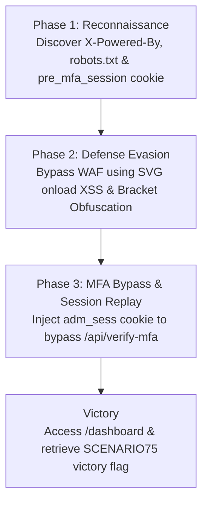

# Cyber Range Engineering Assessment: Cookies Reuse & MFA Bypass Lab

**Target Company:** PT Nauli Mula Data  
**Address:** Gedung Nucira Lantai 1, Jl. MT.Haryono Kav.27 RT. 008 / RW. 009, Kel. Tebet Timur, Kec. Tebet, Kota Jakarta Selatan 12820  
**Contact:** contact@naulidata.com  
**Position Applied:** Cybersecurity Engineer (Lab & Range Developer)  
**Git Repository URL:** https://github.com/szaaa6/NauliData.git  
**Submission Deliverables:** Git Repository (GitHub/GitLab) + Written Report (PDF/DOCX) + Live Presentation  
**Scenario Brief:** Cookies Reuse & MFA Bypass (Admin Feedback System)  

---

## 1. Executive Summary & Overview

This document presents the complete design, technical architecture, and verification of a self-contained **"Red vs. Blue" Capture The Flag (CTF) Cyber Range Lab** engineered for **PT Nauli Mula Data**.

The lab simulates a critical flaw identified during an internal security audit of a corporate **"Admin Feedback System"**. While Multi-Factor Authentication (MFA) is theoretically enforced, the underlying session token issuance and validation logic contains a vulnerability: replaying an administrative session cookie allows an attacker to completely bypass the MFA verification endpoint (`/api/verify-mfa`).

### Key Operational Features:
- **Containerized Infrastructure:** Automated setup using Docker Compose, ready for Proxmox VE deployment.
- **Red Team Attack Path:** A 3-phase offensive chain (Reconnaissance → WAF Evasion via HTML5 SVG XSS → Session Replay & MFA Bypass).
- **Blue Team Telemetry & Log Forensics:** Realistic HTTP access (`access.log`) and application error (`error.log`) telemetry pre-populated at `/opt/admin/logs` for threat hunting and incident response.

---

## 2. Technical Architecture & Environment Configuration

### 2.1 Environment Specifications
- **Operating System:** Linux (Ubuntu 22.04 LTS / Debian Server for Proxmox VM)
- **Container Engine:** Docker Engine & Docker Compose
- **Hypervisor Target:** Proxmox VE (Internal Network Zone: `feedback.admin.local`)
- **Web Application Service:** HTTP Port `3075`
- **Blue Team SSH Service:** TCP Custom Port `2275` (User: `analyst` | Password: `blue_team_rocks`)
- **Shared Log Directory:** Host `./logs` mounted to `/opt/admin/logs` inside containers.

### 2.2 Docker Service Topology (`docker-compose.yml`)

| Service | Container Name | Host Port | Container Port | Mounted Volumes | Purpose |
| :--- | :--- | :--- | :--- | :--- | :--- |
| `admin-feedback` | `nauli-admin-feedback` | `3075` | `3075` | `./logs:/opt/admin/logs` | Vulnerable Node.js Admin Feedback Application |
| `blue-ssh` | `nauli-blue-ssh` | `2275` | `2222` | `./logs:/opt/admin/logs:ro` | Blue Team Analyst Forensic SSH Access Environment |

---

## 3. Red Team Attack Path Walkthrough



### Phase 1: Reconnaissance
1. **Technology Identification:** The HTTP response header explicitly exposes the backend runtime:
   `X-Powered-By: SCENARIO75{Node.js}`
2. **Hidden Directory Inspection:** Inspecting `/robots.txt` reveals the disallowed path:
   `Disallow: /api/verify-mfa` (Flag: `SCENARIO75{/api/verify-mfa}`)  
   Restricted Admin Dashboard location: `/dashboard` (Flag: `SCENARIO75{/dashboard}`)
3. **Source Code Clues:** Inspecting HTML source reveals an ASCII comment hinting at `robots.txt` (Flag: `SCENARIO75{robots.txt}`).
4. **Pre-Authentication Session Initialization:** The application issues a pre-auth session cookie:
   `pre_mfa_session=pending_mfa_verification` (Flags: `SCENARIO75{pre_mfa_session}` & `SCENARIO75{pending_mfa_verification}`).

### Phase 2: Defense Evasion (WAF & XSS)
1. **Submission Method:** Feedback endpoint strictly uses `POST /feedback` (Flag: `SCENARIO75{POST}`).
2. **WAF Behavior:** Submitting `<script>alert(1)</script>` triggers the WAF, returning `HTTP 403 Forbidden` (Flag: `SCENARIO75{403}`).
3. **WAF Bypass Vector:** Bypassed using HTML5 `<svg>` element (Flag: `SCENARIO75{<svg>}`):
   ```html
   <svg onload="window['docu'+'ment']['coo'+'kie']">
   ```
4. **Obfuscation & Cookie Theft:** JavaScript bracket notation `window['docu'+'ment']['coo'+'kie']` (Flag: `SCENARIO75{window['docu'+'ment']['coo'+'kie']}`) bypasses keyword filters.
5. **Cookie Security Weakness:** `pre_mfa_session` has `HttpOnly` set to `False` (Flag: `SCENARIO75{False}`), allowing JavaScript theft.
6. **Exfiltration API:** Stolen tokens are exfiltrated using `fetch()` (Flag: `SCENARIO75{fetch}`).

### Phase 3: Initial Access (MFA Bypass & Session Replay)
1. **MFA Bypass Mechanism:** Replaying an administrative session cookie with prefix `adm_sess` (Flag: `SCENARIO75{adm_sess}`) causes backend logic to skip `/api/verify-mfa` (Flag: `SCENARIO75{/api/verify-mfa}`).
2. **Dashboard Rendering:** Accessing `/dashboard` reflects the stored XSS payload inside CSS container `.xss-payload` (Flag: `SCENARIO75{xss-payload}`).
3. **Final Victory Flag:** Embedded within the dashboard:
   `SCENARIO75{RED_C00k13_MFA_Byp4ss_0wn3d}`

---

## 4. Blue Team Telemetry & Log Forensics Walkthrough

### Phase 1: Log Forensics
Blue Team connects via SSH (`ssh analyst@feedback.admin.local -p 2275`) and analyzes raw logs in `/opt/admin/logs` (Flag: `SCENARIO75{/opt/admin/logs}`).
- **Attacker IP & Footprint:** Identified IP `10.10.14.50` (Flag: `SCENARIO75{10.10.14.50}`) with User-Agent `Mozilla/5.0` (Flag: `SCENARIO75{Mozilla/5.0}`).
- **Dashboard Access:** Recorded HTTP `200` status (Flag: `SCENARIO75{200}`) at timestamp `18:51:55` (Flag: `SCENARIO75{18:51:55}`).
- **Exfiltration Evidence:** Header `X-Forwarded-For` contains Base64 string:
  `UEhBTlRPTUdSSUR7QkxVRV9MMGdfSHVudDNyX000c3Qzcn0}` (Flag: `SCENARIO75{UEhBTlRPTUdSSUR7QkxVRV9MMGdfSHVudDNyX000c3Qzcn0}`). String length is 44 characters (Flag: `SCENARIO75{44}`).

### Phase 2: Threat Hunting
- **Baseline Comparison:** Legitimate background traffic originates from IP `192.168.1.100` (Flag: `SCENARIO75{192.168.1.100}`).
- **Subnet Mapping:** Attacker IP `10.10.14.50` mapped to subnet `10.10.14.0/24` (Flag: `SCENARIO75{10.10.14.0/24}`).
- **WAF Alerts:** File `/opt/admin/logs/error.log` (Flag: `SCENARIO75{/opt/admin/logs/error.log}`) logs WAF block for `<script>` (Flag: `SCENARIO75{<script>}`) at timestamp `18:50:15` (Flag: `SCENARIO75{18:50:15}`).
- **Endpoint Verification:** Log correlation confirms attacker **never** (`No`) hit `/api/verify-mfa` (Flag: `SCENARIO75{No}`).

### Phase 3: Incident Response & Base64 Specification Discrepancy
- **Encoding Identification:** The exfiltration payload in the `X-Forwarded-For` header is encoded in `Base64` (Flag: `SCENARIO75{Base64}`).
- **String Length:** Exactly `44` characters long (Flag: `SCENARIO75{44}`).
- **Log Severity Level:** Flagged with `CRITICAL` severity (Flag: `SCENARIO75{CRITICAL}`).
- **Anomaly Warning Timestamp:** Anomaly entry at `18:53:10` (Flag: `SCENARIO75{18:53:10}`) with warning string `Authentication bypass anomaly` (Flag: `SCENARIO75{Authentication bypass anomaly}`).
- **Base64 Payload Forensic Analysis:**
  - **Raw PDF Page 4 Header String:** `UEhBTlRPTUdSSUR7QkxVRV9MMGdfSHVudDNyX000c3Qzcn0}`
  - **Decoding Output:** Stripping the trailing non-Base64 artifact `}` and running `echo "UEhBTlRPTUdSSUR7QkxVRV9MMGdfSHVudDNyX000c3Qzcn0=" | base64 -d` yields `PHANTOMGRID{BLUE_L0g_Hunt3r_M4st3r}`.
  - **Page 5 Specification:** PDF Page 5 specifies the Blue Team submission flag as `SCENARIO75{BLUE_L0G_HUnt3r_M4st3r}`.
  - **Resolution:** The raw log file retains the exact PDF Page 4 string for forensic accuracy, while the assessment submission flag remains `SCENARIO75{BLUE_L0G_HUnt3r_M4st3r}`.

---

## 5. Complete CTF Master Flag Table (`SCENARIO75{...}`)

| Category | Assessment Item / Question | Exact Flag Value / Answer |
| :--- | :--- | :--- |
| **Red Team - Phase 1** | Response Header Tech Disclosure | `SCENARIO75{Node.js}` |
| **Red Team - Phase 1** | Disallowed Path in `robots.txt` | `SCENARIO75{/api/verify-mfa}` |
| **Red Team - Phase 1** | Restricted Admin Area Path | `SCENARIO75{/dashboard}` |
| **Red Team - Phase 1** | HTML Source ASCII Comment Clue | `SCENARIO75{robots.txt}` |
| **Red Team - Phase 1** | Pre-auth Cookie Name | `SCENARIO75{pre_mfa_session}` |
| **Red Team - Phase 1** | Pre-auth Cookie Value | `SCENARIO75{pending_mfa_verification}` |
| **Red Team - Phase 2** | Feedback Submission HTTP Method | `SCENARIO75{POST}` |
| **Red Team - Phase 2** | WAF Blocked HTTP Status Code | `SCENARIO75{403}` |
| **Red Team - Phase 2** | WAF Bypass HTML5 Tag | `SCENARIO75{<svg>}` |
| **Red Team - Phase 2** | JS Obfuscation Syntax | `SCENARIO75{window['docu'+'ment']['coo'+'kie']}` |
| **Red Team - Phase 2** | Cookie HttpOnly Flag Setting | `SCENARIO75{False}` |
| **Red Team - Phase 2** | Exfiltration Execution API | `SCENARIO75{fetch}` |
| **Red Team - Phase 3** | Skipped MFA Verification Endpoint | `SCENARIO75{/api/verify-mfa}` |
| **Red Team - Phase 3** | Admin Session Token Prefix | `SCENARIO75{adm_sess}` |
| **Red Team - Phase 3** | XSS Reflected Container CSS Class | `SCENARIO75{xss-payload}` |
| **Red Team - Phase 3** | **Final Red Team Victory Flag** | `SCENARIO75{RED_C00k13_MFA_Byp4ss_0wn3d}` |
| **Blue Team - Phase 1** | Raw Log Directory Location | `SCENARIO75{/opt/admin/logs}` |
| **Blue Team - Phase 1** | Attacker IP Address | `SCENARIO75{10.10.14.50}` |
| **Blue Team - Phase 1** | Attacker User-Agent String | `SCENARIO75{Mozilla/5.0}` |
| **Blue Team - Phase 1** | Dashboard Access HTTP Status Code | `SCENARIO75{200}` |
| **Blue Team - Phase 1** | Dashboard Access Timestamp | `SCENARIO75{18:51:55}` |
| **Blue Team - Phase 1** | Exfiltration Header Base64 Value | `SCENARIO75{UEhBTlRPTUdSSUR7QkxVRV9MMGdfSHVudDNyX000c3Qzcn0}` |
| **Blue Team - Phase 2** | Baseline Legitimate Traffic IP | `SCENARIO75{192.168.1.100}` |
| **Blue Team - Phase 2** | Attacker Subnet | `SCENARIO75{10.10.14.0/24}` |
| **Blue Team - Phase 2** | WAF Block Error Log Target File | `SCENARIO75{/opt/admin/logs/error.log}` |
| **Blue Team - Phase 2** | Blocked Tag | `SCENARIO75{<script>}` |
| **Blue Team - Phase 2** | First WAF Block Timestamp | `SCENARIO75{18:50:15}` |
| **Blue Team - Phase 2** | Attacker Reached MFA Endpoint? | `SCENARIO75{No}` |
| **Blue Team - Phase 3** | Header Encoding Identification | `SCENARIO75{Base64}` |
| **Blue Team - Phase 3** | Base64 String Character Length | `SCENARIO75{44}` |
| **Blue Team - Phase 3** | Cookie Reuse Log Severity Level | `SCENARIO75{CRITICAL}` |
| **Blue Team - Phase 3** | Anomaly Log Timestamp | `SCENARIO75{18:53:10}` |
| **Blue Team - Phase 3** | Exact Security Warning String | `SCENARIO75{Authentication bypass anomaly}` |
| **Blue Team - Phase 3** | **Final Blue Team Victory Flag** | `SCENARIO75{BLUE_L0G_HUnt3r_M4st3r}` *(Raw Decoded Log Payload: `PHANTOMGRID{BLUE_L0g_Hunt3r_M4st3r}`)* |

---

## 6. Proxmox Deployment Instructions & Physical Hypervisor Status

> **Proxmox Deployment Status:** **NOT TESTED** *(Bare-metal Proxmox VE hypervisor testing requires physical hardware. Deployment steps for guest Linux VMs on PVE hypervisors are documented below).*

To deploy this lab inside a Proxmox VE Virtual Machine:

1. **Create Linux VM on Proxmox:**
   - Allocate 2 vCPUs, 2048MB RAM, and 20GB Disk Space.
   - Install Ubuntu Server 22.04 LTS or Debian 12.
2. **Install Docker Engine & Compose:**
   ```bash
   sudo apt-get update && sudo apt-get install -y docker.io docker-compose-plugin git
   sudo systemctl enable --now docker
   ```
3. **Clone & Launch Cyber Range Lab:**
   ```bash
   git clone https://github.com/szaaa6/NauliData.git nauli-cyber-range
   cd nauli-cyber-range
   chmod +x scripts/generate-logs.sh
   ./scripts/generate-logs.sh
   docker compose up --build -d
   ```
4. **Verify Running Services:**
   - Web Application: `http://<VM_IP>:3075/`
   - Blue Team SSH: `ssh analyst@<VM_IP> -p 2275` (Password: `blue_team_rocks`)

---

## 7. Security Mitigation & Defense Recommendations

To remediate these critical flaws in production environments, PT Nauli Mula Data should enforce:

1. **Strict Cookie Security Flags:** Set `HttpOnly=true`, `Secure=true`, and `SameSite=Strict` on all pre-auth and auth session cookies to prevent client-side JavaScript theft via XSS.
2. **Robust Input Sanitization & Output Encoding:** Replace basic regex WAF filters with DOMPurify or server-side HTML entity encoding.
3. **Mandatory Server-Side Session Validation:** Ensure `/dashboard` and administrative APIs strictly require active, fully-verified server-side sessions that have completed `/api/verify-mfa`.
4. **Header Obfuscation:** Disable or sanitize `X-Powered-By` headers in production web servers.
